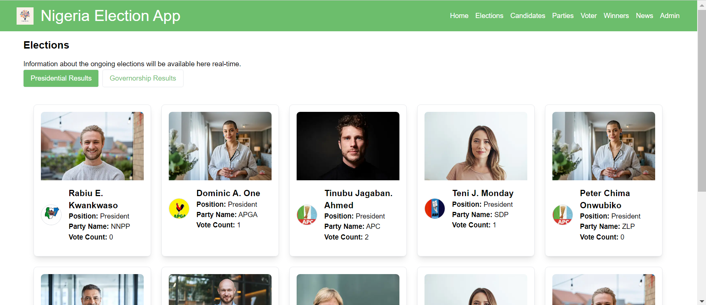
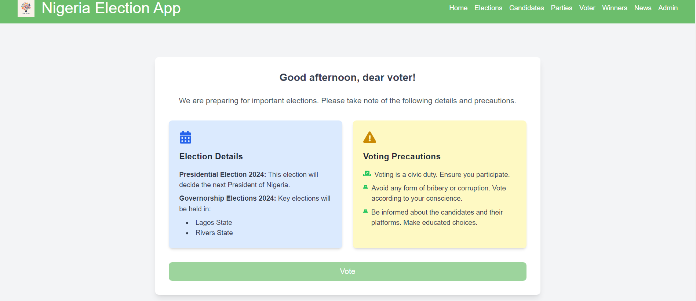

## Table of Contents

- [Nigeria Election App](#nigeria-election-app)
- [Demo](#demo)
- [PORTS](#ports)
- [License](#license)
- [Installation](#installation)
    - [Clone the repository](#clone-the-repository)
    - [Navigate to the project directory](#navigate-to-the-project-directory)
    - [Install dependencies for the backend](#install-dependencies-for-the-backend)
    - [Install dependencies for the frontend](#install-dependencies-for-the-frontend)
    - [Start the backend server](#start-the-backend-server)
    - [Start the frontend server](#start-the-frontend-server)
- [Voting](#voting)
- [FAQ](#faq)
    - [How do I report a bug?](#how-do-i-report-a-bug)
- [Gallery](#gallery)

# Nigeria Election App

Nigeria Election App simulates online voting using the Voter's card and Independent National Electoral Commission (INEC) IREV voting system. Built with Vite, ReactJS, Tailwind CSS, Cypress and Express.js.

# Demo

[https://naija-election-app-frontend.onrender.com/](https://naija-election-app-frontend.onrender.com/)

# PORTS

1. Front-end: 5000
2. Back-end: 8000
3. Ensure in deployment, change the CORS_ORIGIN to the url `CORS_ORIGIN=http://the-production-frontend-url.com`

# License

This software is licensed under the MIT License. See [LICENSE](./LICENSE) for more details.

# Installation

### Clone the repository

`git clone https://github.com/Jedidiah-Solomon/Nigeria_Election_App.git`

### Navigate to the project directory

`cd Nigeria_Election_App`

### Install dependencies for the backend

```
cd Backend
npm install
```

### Install dependencies for the frontend

```
cd ../Frontend
npm install
```

### Start the backend server

cd ../Backend <br/>
`npm start or npm run dev` depending on production or development respectively.

### Start the frontend server

cd ../Frontend <br/>
`npm start or npm run dev` depending on production or development respectively.

# Voting

1. Please ensure you visit `candidates` link to see various candidates and their bio-data, then move to #2.
2. Voter clicks `voter` --> `vote` --> Voter inputs correct credentials with NIN to login
3. Select either Governorship or Presidential election.
4. Fill details accordingly.

# FAQ

### How do I report a bug?

Submit an issue on our GitHub repository with detailed information about the bug.

# Gallery








