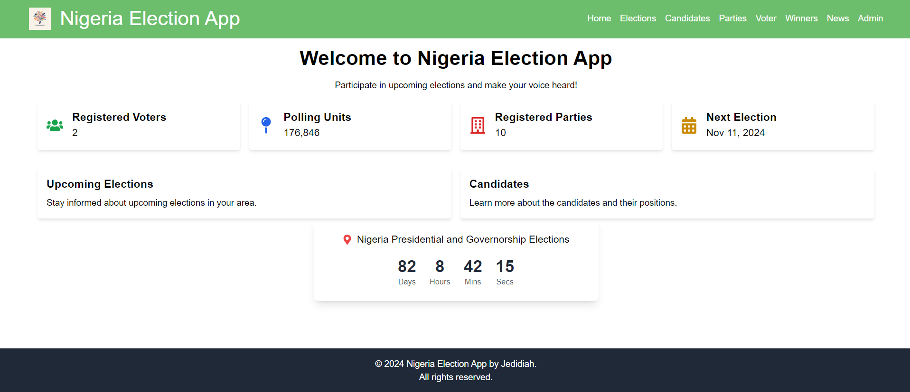

## Table of Contents

- [Nigeria Election App](#nigeria-election-app)
- [PORTS](#ports)
- [Voting](#voting)
- [Gallery](#gallery)
- [License](#license)

# Nigeria Election App

Nigeria Election App simulates online voting using the Voter's card and Independent National Electoral Commission (INEC) IREV voting system.

# PORTS

1. Front-end: 5000
2. Back-end: 8000
3. Ensure in deployment, change the CORS_ORIGIN to the url `CORS_ORIGIN=http://the-production-frontend-url.com`

# Voting

1. Please ensure you visit `candidates` link to see various candidates and their bio-data, then move to #2.
2. Voter clicks `voter` --> `vote` --> Voter inputs correct credentials with NIN to login
3. Select either Governorship or Presidential election.
4. Fill details accordingly.

# Gallery

# License

This software is free, you can fork, download, modify and use as you like. Read License for more details.
